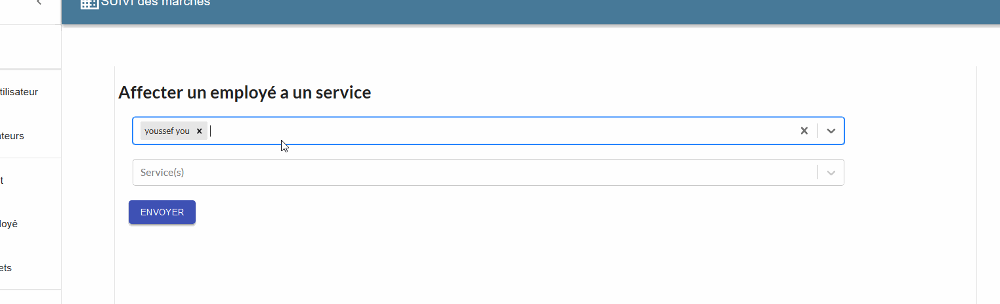

# Suivi des marchés

# Lancer l'application
### yarn start ;
Open http://localhost:3001 to view it in the browser.

# Affecter un employé a un service

# Gestion des utilisateurs
### Il est aussi possible de filtrer les utilisateurs en fonctions des différents champs (nom, prénom, email, rôle..) et de modifier leurs informations ou de les supprimer de la base de donnée

# acceder aux taches d'un service donné

# gestion des taches

# commentaires

# Scheduler
grace au component dx-react-scheduler https://devexpress.github.io

